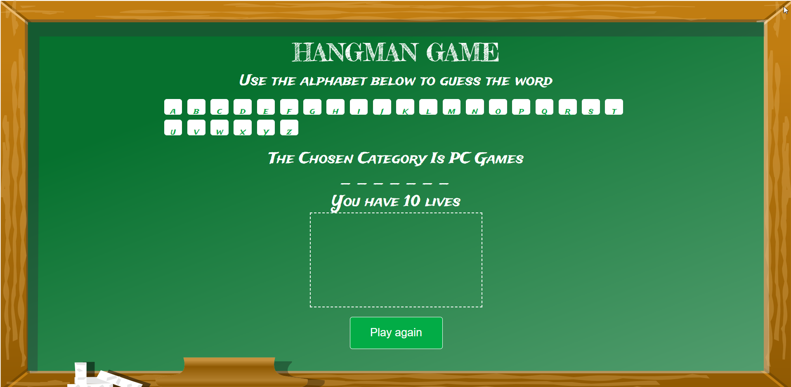
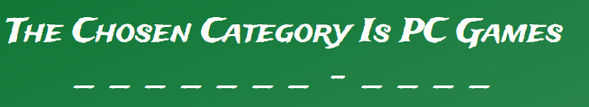

<br />
<p align="center">
  <a href="https://ewa-ilnicka.github.io/hangman/">
    
  </a>
  <h3 align="center">Hangman game</h3>
  </p>
<p>
    A classic word game in which you must guess a secret word. It was made with <a href="https://kodilla.com/pl">Kodilla</a> tutorial to practice my JavaScript skills.
    </p>


## Table of Contents

* [About the Project](#about-the-project)
  * [Built With](#built-with)
* [Getting Started](#getting-started)
  * [Prerequisites](#prerequisites)
  * [Installation](#installation)
* [Usage](#usage)
* [Roadmap](#roadmap)
* [Contact](#contact)
* [Acknowledgements](#acknowledgements)


## About The Project


There are many great Hangman tutorials available on the Internet and I decided to learn from one made by Kodilla - programming school with many bootcamps and courses for young programmers.


### Built With
To built this project I used:
* [HTML](https://en.wikipedia.org/wiki/HTML)
* [CSS](https://en.wikipedia.org/wiki/Cascading_Style_Sheets)
* [Java Script](https://en.wikipedia.org/wiki/JavaScript)


## Getting Started

To get a local copy up and running follow these simple example steps.

### Prerequisites

To open index.html you need any browser (altough I don't recommend Internet Explorer).

### Installation

1. Clone the repo
```sh
git clone https://github.com/your_username_/Project-Name.git
```
or download ZIP.

2. Open index.html with any browser.

3. Have fun playing the game.


## Usage

There are three categories with a few words. In the tutorial there were diffrent words so I decided to change them (also with categories) to these that I'm interested in.





## Roadmap

What I am planning to do:

1. Words and ctegories in json.
2. Different design maybe including animation for drawing hangman.
3. Points counting and score.


## Contact

Ewa Ilnicka - [ewailnicka.pl](http://www.ewailnicka.pl/) - ewa.h.ilnicka@gmail.com

Project Link: [https://github.com/ewa-ilnicka/hangman](https://github.com/ewa-ilnicka/hangman)


## Acknowledgements
* [README template](https://github.com/othneildrew/Best-README-Template)
* [Hangman tutorial](https://kodilla.com/pl/gra-hangman-wyzwanie)
* [Pixabay](https://pixabay.com/)